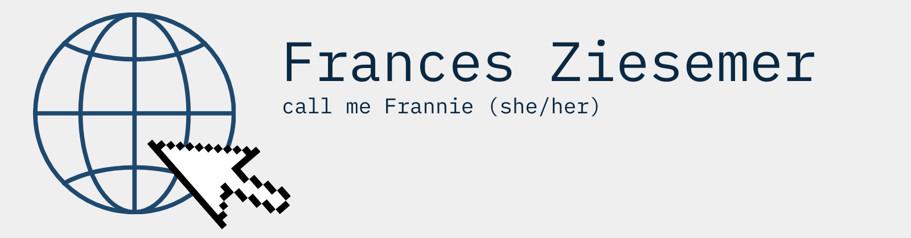

<!--
**frannieziesemer/frannieziesemer** is a ✨ _special_ ✨ repository because its `README.md` (this file) appears on your GitHub profile.

I am a Web Developer-in-training focusing at the moment on mastering JavaScript + React and learning how to doucument and test my code. 

My current projects are:
- End-to-end app development with the amazing FrauenLoop program
- The Odin Project JavaScript Full Stack track
- #100DaysOfCode

follow my #100DaysOfCode journey on twitter @FZiesemer
check out my profile on LinkedIn

- 🔭 I’m currently working on ...
- 🌱 I’m currently learning ...
- 👯 I’m looking to collaborate on ...
- 🤔 I’m looking for help with ...
- 💬 Ask me about ...
- 📫 How to reach me: ...
- 😄 Pronouns: ...
- ⚡ Fun fact: ...
-->
