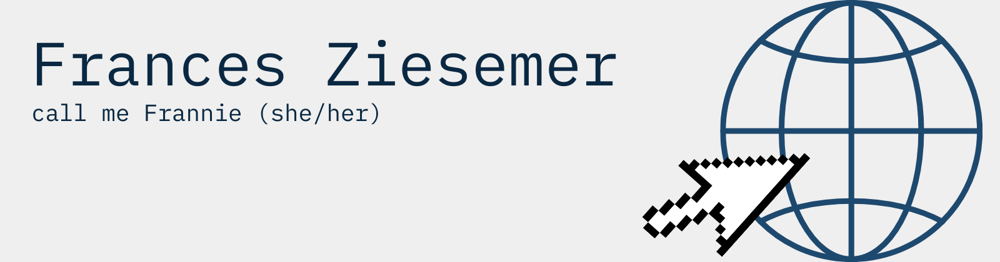

<!--
<!--
**frannieziesemer/frannieziesemer** is a ✨ _special_ ✨ repository because its `README.md` (this file) appears on your GitHub profile.-->

I am a Web Developer-in-training 🏋‍♂️️ focusing at the moment on mastering JavaScript + React.js and all of the other wonderful things that go along. 

My current projects are:
- End-to-end web development with the amazing [FrauenLoop](https://www.frauenloop.org/) program
  - stay tuned...
  
- The Odin Project JavaScript Full Stack track
  - restaurant page   | [live site](https://frannieziesemer.github.io/restaurant-page/) | [git repo](https://github.com/frannieziesemer/restaurant-page) | 
  - library   | [live site](https://frannieziesemer.github.io/library/) | [git repo](https://github.com/frannieziesemer/library) |
  - scissors-paper-rock   | [live site](https://frannieziesemer.github.io/rock-paper-scissors/) | [git repo](https://github.com/frannieziesemer/rock-paper-scissors) |
  - etch-a-sketch   | [live site](https://frannieziesemer.github.io/etch-a-sketch/) | [git repo](https://github.com/frannieziesemer/etch-a-sketch) |

- [Coding Challenges](https://github.com/frannieziesemer/coding-challenges)

follow my #100DaysOfCode journey on twitter [@FZiesemer](https://twitter.com/FZiesemer)

check out my profile on [LinkedIn](https://www.linkedin.com/in/frannie-ziesemer/)

send me an email frances.ziesemer@gmail.com

<!--- 🔭 I’m currently working on ...
- 🌱 I’m currently learning ...
- 👯 I’m looking to collaborate on ...
- 🤔 I’m looking for help with ...
- 💬 Ask me about ...
- 📫 How to reach me: ...
- 😄 Pronouns: ...
- ⚡ Fun fact: ...
-->
